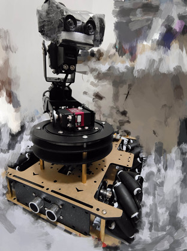
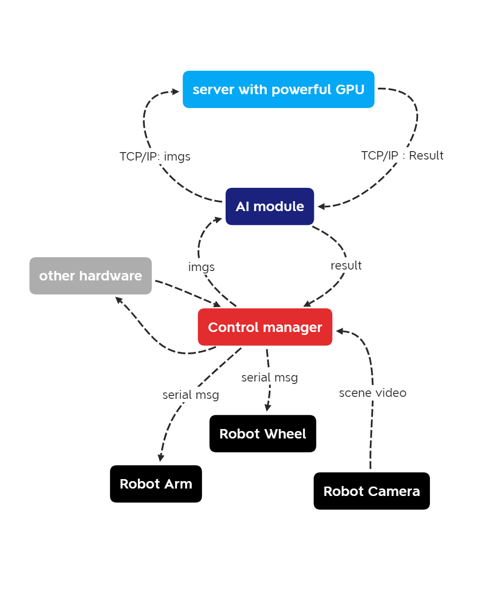
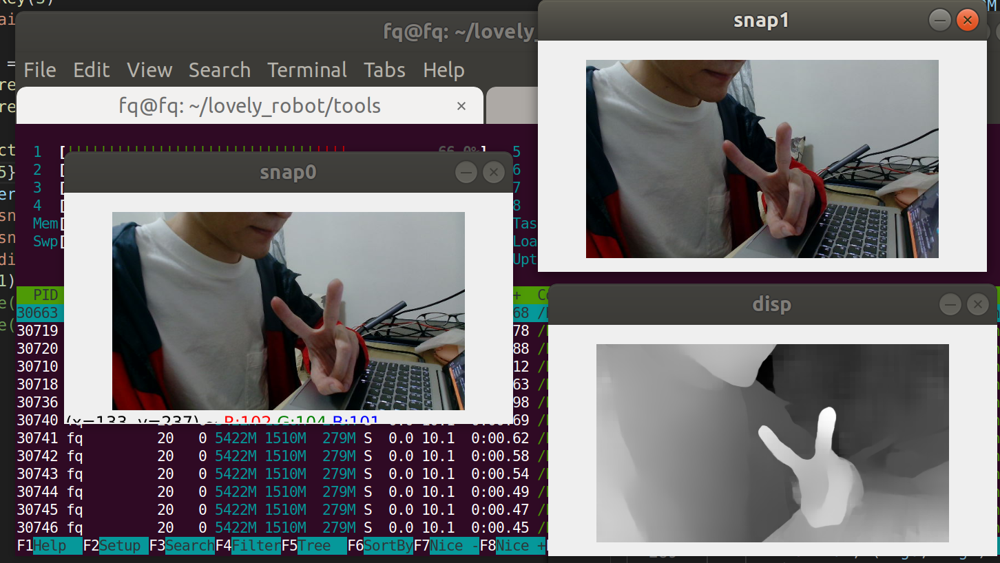
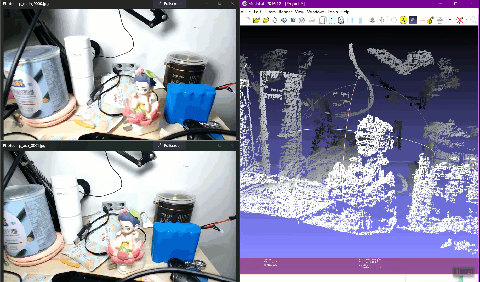
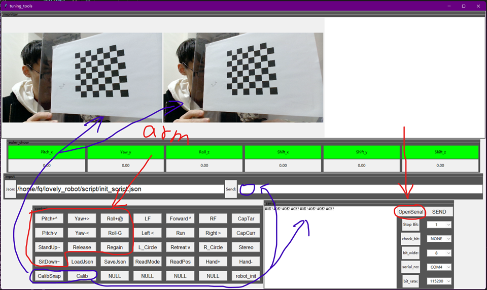

# lovely_robot

A Robot; YOLOX run on raspberry PI; object detection; object tracking; stereo matching and 3D reconstruction (camera calib is included); 

| robot  | YOLOX running on raspberry PI  |
| ----  | ---- |
|  |   |
|  |    |
| **SGBM Stereo** |  |
| **Master tracking  is Coming** | **Master tracking is Coming** |

## introduce
This respo is created on a whim. someday i thought about if i have a robot like BB8 that should be cool.
so i bought a raspberry pi 4B with wheels under it and machine hand on it. It is far away frome BB8. Doesnt matter, i like it.
I am a C++ programmer major on computer vision, so some of my code is not follow the pep8 regulation~ hope you forgive me.
# tutorials
in this respo, you will get to know how to build a robot with raspberry pi. It may contains: Camera calibration \ stereo camera calibration(for advance) \ serial communication \ steering control \ image processing with opencv

## suggest: USE MY 64BITs OS img
why change raspberry os to my os img?
1) differ from others, my img is 64bits, which means more bits in cpu can be used.
2) default conda env was configurated, with pytorch and torchvision. Also, a YOLOX object detection demo can be run.(/home/pi/github/YOLOX/YOLOX-outputs). Sounds crazy.
3) username is : pi ; password is raspberry ; but no create-ap by init, so if you dont have a micro-hdmi, there is a hard way: use your phone make a hotpoint:SSID:"NETGEAR", password:"qazwsxed", and ssh or VNC from your pc.
4) over_voltage and over_freq to 1.85GHz, by default, so plug-in a powerfull elec or delete "*freq *volt" in /boot/config.txt before boot.
5) backup your OS img.
U can get my OS img in https://drive.google.com/file/d/1sVcg3a_ZkeueHfw6wLsLdO8kOLZtYnCf/view?usp=sharing
OR install \ config \ compile pytorch etc on your own. many accident will happen, good luck.

PS: something interesting during my work was recorded. See TAG_commit_log.md for important commit, and doc/somthing_interesting.md for detail.

## How to use tuning_tools?
why i build a tuning tools?

(at tools/tuning_tools.py)

Because write command for robot is tough and it is unfriendly for debug. Tuning tools looks like that:(you can get design GUI in 'doc' folder with Viso format)

In this GUI tool, you will be able to control robert arm \ wheels \ Serial port message \ calibrate camera etc...

The GUI of tuning tools grouped by monitor \ euler monitor \ input box \ control buttons \ Serial port receiver

Tuning tools is worked on your PC. Your PC are connected the robot with usb serial tranformer instead raspberry. so, with serial command sended, you can easily know what happened.

If you dont have a robot but you only want to use this tools to calibrate your camera it also works. Click the 'CalibSnap' button and you are ready for calib your camera. both single camera calibration and stereo camera calibration are supported.

### how to calibrate camera?
calibration is part of the tuning tools. as you can see, on the left-bottom of the tuning_tools, you will get two button about calib. click the 'CalibSnap' to configure your param about your camera, and click it agan to the next \ next \ next \ and also use it to collect chessboard picture. if you finish the 'taking chessboard picture' part, click 'Calib' and waitting for its done. read 'doc/how_to_use_calib_tools.md' for more infomation.

### how to use Serial tuning tools?
~~the GUI design file(visio) was put at doc/tuning_tools.* what each button work just follow its name. One more thing: config_scripts.py define some action about steering and capture. i use opencv VideoCapture for grap frame from camera. so GUI tuning is also used for tuning image processing. camera id is defined by cam_mode_single_cam_id if you use only one camera; cam_mode_stereo_cam_id if you use 2 cameras.you can acquire video stream from camera by mouse left click 'CapTar' 'CapCur' individually and mouse right click for grap a snapshoot then do something interesting (replace the "DoNothing" function defined in config_fasci.py)~~

### Reference
https://github.com/zacjiang/GMA  
https://github.com/Megvii-BaseDetection/YOLOX  