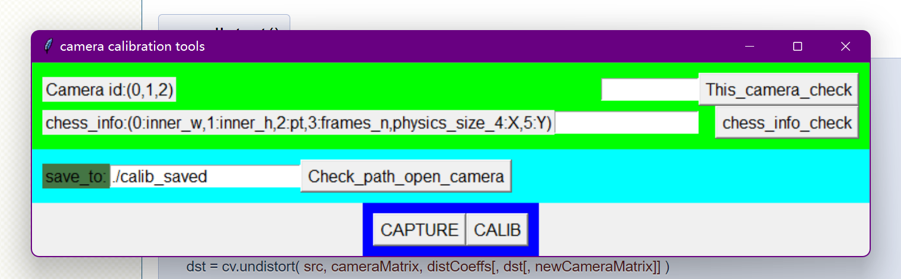
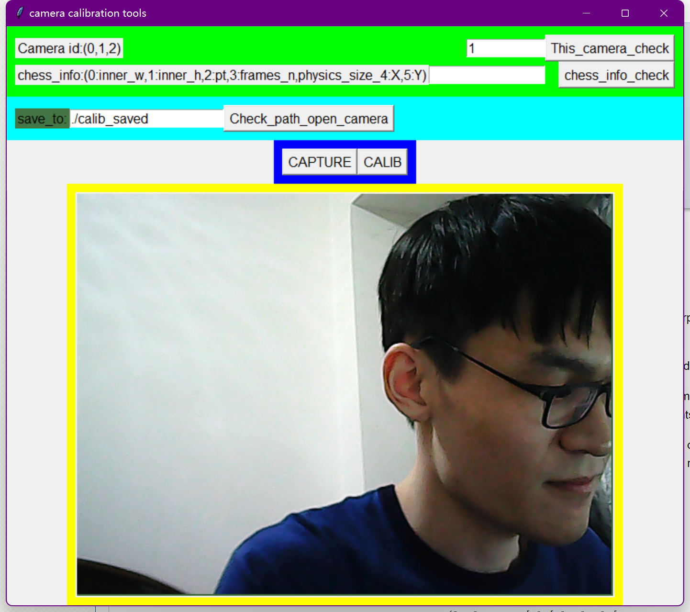

# lovely_robot
my robot puppy~

## introduce
This respo is created on a whim. someday i thought about if i have a robot like BB8 that should be cool.
so i bought a raspberry pi 4B with wheels under it and machine hand on it. It is far away frome BB8. Doesnt matter, i like it.
# tutorials
in this respo, you will get to know how to build a robot with raspberry pi. It may contains: Camera calibration \ stereo camera calibration(for advance) \ serial communication \ steering control \ image processing with opencv

### how to calibrate camera?
I write a calib tool in '/tools' but it is ugly and imcomplete. anyway, it works for single camera calib. I finish this tool at the dead of night with dizzy and sleepy. forgive me.
It looks like this:
the first two input is used to config the camera info, then click the button, change the capture picture save to "which folder" and click opencamera will open the camera u select in row 1. shows:

### how to use Serial tuning tools?
tuning_tools was put at tools/tuning_tools.py
the GUI design file(visio) was put at doc/tuning_tools.* what each button work just follow its name. One more thing: config_scripts.py define some action about steering and capture. i use opencv VideoCapture for grap frame from camera. so GUI tuning is also used for tuning image processing. camera id is defined by cam_mode_single_cam_id if you use only one camera; cam_mode_stereo_cam_id if you use 2 cameras.you can acquire video stream from camera by mouse left click 'CapTar' 'CapCur' individually and mouse right click for grap a snapshoot then do something interesting (replace the "DoNothing" function defined in config_fasci.py)