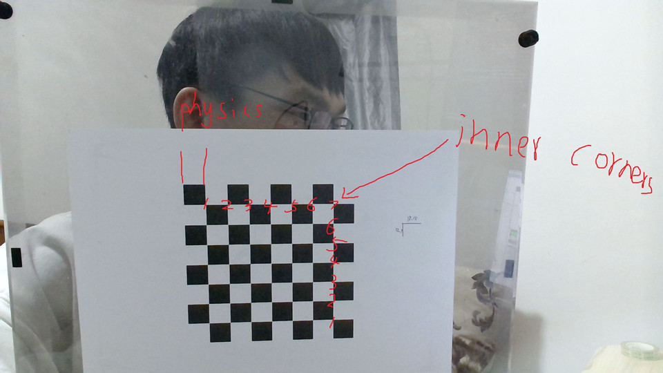
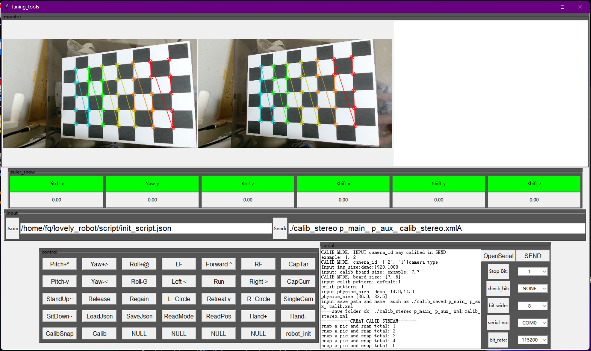
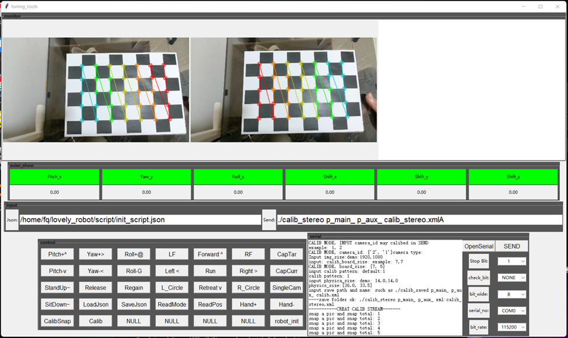

# How to calibrate your camera use tuning tools

## Step 1: prepare
all you need:
1. a camera which is fully focused(the focalizing system cant be change if calibration is over)
2. a chessboard. you can get it easily in opencv
3. a PC with python env

## Step 2: config info about your camera

1. run: 

''' 
python3 tuning_tools.py
'''

2. click 'CalibSnap' button
3. some notice message shown in receiver box, follow it: input camera id, if calib a caemra, input your camera id, like:"1" and go to step 2( i mean click 'CalibSnap' again more info about your camera and chessboard need to be configured)

NOTICE: inner point(board_size) is shown in pic_img/chessboard.jpg

4. if you collect enough pictures, click 'Calib' and every thing will shown in the folder which specified by you(such as "./calib_stereo p_main_ p_aux_ calib_stereo.xml")

5. up to now, it doesnt mean every thing is over. check out in 'XXX/tmp' folder, chess_corners were drawn in pictures you just take. for calibration compute, the corners sequences is important. red-to-blue is the corners sequence. make sure your corners sequence all right. wrong demo is shown in "calib_stereo_wrong" if some of them are wrong, delet it (for stereo camera, one mistake two deleted) and run camera_calib.py to calib again

a calib demmo of my stereo camera is shown in "calib_stereo" ( my chessboard is not perfect, so the calibration result may not that perfect)

Right:

Bad:

